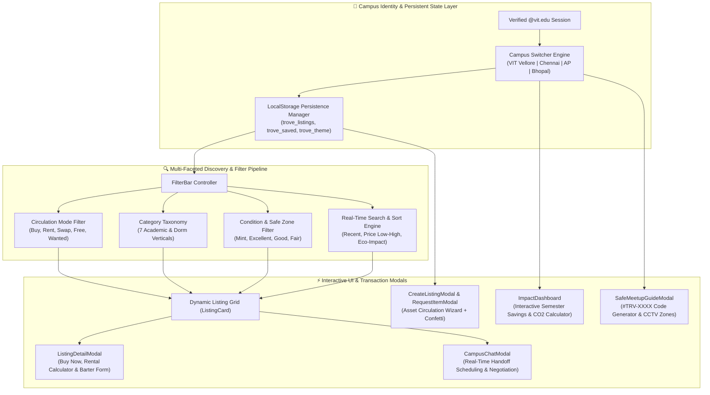

<div align="center">

# 🏛️ CLS — Trove: Student-Powered Campus Circulation Network
### Circulate Knowledge. Share Essentials. Empower Your Campus Economy.

A student-powered circular economy web platform enabling peer-to-peer buying, selling, renting, bartering, and zero-cost sharing of academic resources and campus essentials within verified university trust circles.

[](https://react.dev)
[](https://vitejs.dev)
[](https://tailwindcss.com)
[](https://lucide.dev)
[](https://oxc.rs)
[-002B49?style=for-the-badge)]()
[](LICENSE)

<br>

<p align="center">
  <a href="#-key-features"><b>Explore Features</b></a> •
  <a href="#-system-architecture"><b>Architecture</b></a> •
  <a href="#-5-dynamic-circulation-modes"><b>Circulation Modes</b></a> •
  <a href="#-campus-network--safe-zones"><b>Campus Network</b></a> •
  <a href="#-quick-start"><b>Quick Start</b></a> •
  <a href="#-project-structure"><b>Structure</b></a> •
  <a href="#-connect--author"><b>Connect</b></a>
</p>

</div>

---

## 📖 Overview

Every semester, thousands of university students purchase brand-new textbooks, scientific calculators, engineering mini-drafters, lab coats, bicycles, and dorm appliances at full retail price—only for those items to sit idle or end up discarded during hostel move-outs.

**CLS (Campus Lending & Circulation System — Trove)** solves this inefficiency by creating a closed-loop, student-powered marketplace locked to verified university domains (`@vit.edu`). By combining five flexible circulation modes with designated CCTV-monitored campus handoff zones and real-time sustainability tracking, CLS reduces student living costs by **60–80%** while diverting thousands of kilograms of dormitory waste from landfills.

---

## ✨ Key Features

| Capability | Technical Implementation & Student Value |
| :--- | :--- |
| **🎓 Verified Campus Trust Circles** | Scoped to `@vit.edu` across **VIT Vellore**, **VIT Chennai**, **VIT-AP**, and **VIT Bhopal** with dynamic switching of local listings, safe meetup zones, and campus-wide impact metrics in Indian Rupees (`₹`). |
| **🔄 5 Circulation Archetypes** | Supports **Buy / Sell**, **Borrow / Rent** (daily, weekly, or semester-long), **Exchange / Swap** (direct barter), **Free Share** (Pay-It-Forward donations), and a **Community Wishlist / Wanted Board**. |
| **🌱 Sustainability & Savings Hub** | Features an interactive **Semester Savings Calculator** (`₹`) and live telemetry tracking collective student savings, $\text{CO}_2$ emissions prevented (kg), and items diverted from landfills. |
| **🛡️ CCTV Safe Meetup Zones** | Integrates officially designated high-visibility campus locations (*SJT Gazebo*, *TT Foodys Courtyard*, *Central Library Foyer*, *Main Gate 1*) with `#TRV-XXXX` exchange verification codes and campus security dispatch (`0416-220-2101`). |
| **💬 In-App Chat & Negotiation** | Built-in student messaging simulator for scheduling safe handoffs, negotiating prices or rental deposits, and proposing peer-to-peer item swaps. |
| **🌙 Adaptive Dark Mode & Persistence** | Full Light / Dark theme toggle with system-preference detection and automatic `localStorage` persistence for newly created listings, community requests, and saved favorites. |
| **✨ Interactive Listing Wizards** | Multi-step modals (`CreateListingModal`, `RequestItemModal`, `ListingDetailModal`) with instant eco-impact estimations, rental duration calculators, and `canvas-confetti` celebration triggers. |

---

## 🏛️ System Architecture

The following diagram illustrates the client-side state architecture, multi-campus filtering pipeline, and interactive modal workflows inside **CLS (Trove)**:



---

## 🔄 5 Dynamic Circulation Modes

| Mode | Badge | Primary Use Case | Example Campus Assets |
| :--- | :--- | :--- | :--- |
| **Buy / Sell** | `🏷️ Buy / Sell` | Peer-to-peer resale at 60–80% off campus bookstore retail | Used course textbooks, reference manuals, study lamps, LAN cables |
| **Borrow / Rent** | `📅 Borrow / Rent` | Short-term rentals by day, week, or full semester | Casio `fx-991CW` calculators, engineering mini-drafters, lab coats, DSLR cameras |
| **Exchange / Swap** | `🔄 Exchange / Swap` | Direct zero-cash barter between classmates | Swapping Engineering Graphics gear for Discrete Mathematics textbooks |
| **Free Share** | `🎁 Free Share` | Pay-It-Forward donations during graduating hostel move-outs | Storage crates, mattress toppers, kettle, handwritten subject notes |
| **Requests / Wanted** | `🚨 Wanted Board` | Broadcasting urgent academic or hostel needs to peers | Urgent weekend calculator loan before CAT-1 / CAT-2 or FAT exams |

---

## 🗺️ Campus Network & Safe Zones

CLS dynamically adapts its marketplace, currency metrics, and verified CCTV meetup stations across four VIT campuses:

| Campus | Active Students | Items Circulated | Student Savings | $\text{CO}_2$ Offset | Primary Designated Safe Meetup Zones |
| :--- | :--- | :--- | :--- | :--- | :--- |
| **🏛️ VIT Vellore** | 38,500+ | 14,820+ | `₹48,25,000` | `32,400 kg` | SJT Ground Floor Gazebo, TT Foodys Courtyard, Periyar EVR Library Foyer, Main Gate 1 CCTV Station |
| **🌊 VIT Chennai** | 18,200+ | 6,410+ | `₹22,10,000` | `14,800 kg` | Academic Block 1 Central Atrium, Central Library Circulation Lobby, Gazebo Food Court |
| **☀️ VIT-AP** | 12,500+ | 4,120+ | `₹14,50,000` | `9,800 kg` | Central Block Admin Quadrangle, Central Library Entrance |
| **🌿 VIT Bhopal** | 9,800+ | 2,950+ | `₹10,20,000` | `7,400 kg` | Academic Block Foyer, Learning Resource Centre (LRC) |

---

## 🚀 Quick Start

### Prerequisites
* **Node.js 18+** and **npm** installed on your machine.

### 1. Clone the Repository
```bash
git clone https://github.com/harinarayana1457-cmyk/CLS.git
cd CLS
```

### 2. Install Dependencies
```bash
npm install
```

### 3. Start the Development Server
```bash
npm run dev
```
*Open `http://localhost:5173` in your browser to explore the platform.*

### 4. Build & Lint for Production
```bash
# Run Oxlint static analysis
npm run lint

# Build optimized production bundle
npm run build

# Preview production build locally
npm run preview
```

---

## 📁 Project Structure

```
CLS/
├── public/
│   ├── favicon.svg                  # Custom SVG favicon
│   ├── icons.svg                    # Vector icon sprites
│   └── trove-logo.jpg               # Tri-petal Trove brand emblem
├── src/
│   ├── assets/                      # Static illustrations and brand assets
│   ├── components/
│   │   ├── Navbar.jsx               # Campus switcher, dark mode toggle & quick actions
│   │   ├── HeroBanner.jsx           # Value proposition banner & live trust indicators
│   │   ├── ImpactDashboard.jsx      # Interactive Semester Savings & CO2 offset calculator
│   │   ├── FilterBar.jsx            # Multi-axis filter bar (Mode, Category, Condition, Zone)
│   │   ├── ListingCard.jsx          # Resource card with pricing, badges & favorite toggle
│   │   ├── ListingDetailModal.jsx   # Full resource breakdown, rental calculator & barter form
│   │   ├── CreateListingModal.jsx   # "+ Circulate an Asset" wizard with eco-impact preview
│   │   ├── RequestItemModal.jsx     # Community wishlist broadcaster modal
│   │   ├── CampusChatModal.jsx      # Peer-to-peer chat & safe handoff scheduler
│   │   ├── SafeMeetupGuideModal.jsx # CCTV meetup zones, safety tenets & #TRV-XXXX generator
│   │   ├── UserProfileModal.jsx     # Student reputation, eco-badges & active circulation history
│   │   └── Footer.jsx               # Platform navigation, campus links & emergency dispatch
│   ├── data/
│   │   ├── campuses.js              # Multi-campus telemetry & designated CCTV safe zones
│   │   ├── categories.js            # 5 circulation modes, 7 categories & item condition tiers
│   │   └── mockListings.js          # Realistic VIT student listings, reviews & wanted posts
│   ├── App.jsx                      # Root state container, filtering logic & modal orchestration
│   ├── App.css                      # Component-scoped styles
│   ├── index.css                    # Tailwind CSS v4 imports & custom theme tokens
│   └── main.jsx                     # React 19 DOM entry point
├── index.html                       # Application shell & typography imports (Plus Jakarta Sans)
├── package.json                     # Dependencies and Vite/Oxlint scripts
└── vite.config.js                   # Vite 8 + Tailwind CSS v4 bundler configuration
```

---

## 🛠️ Tech Stack

| Layer | Technology | Version | Purpose |
| :--- | :--- | :--- | :--- |
| **UI Framework** | [React](https://react.dev/) | `19.2.8` | Component architecture, hooks, and reactive state management |
| **Build Tool** | [Vite](https://vitejs.dev/) | `8.3.0` | Lightning-fast HMR development server and ES module bundler |
| **Styling** | [Tailwind CSS](https://tailwindcss.com/) | `4.3.3` | Utility-first styling, responsive grid, and Dark Mode tokens |
| **Iconography** | [Lucide React](https://lucide.dev/) | `1.52.0` | Clean, consistent vector icons for categories and trust badges |
| **Micro-Interactions** | [Canvas Confetti](https://www.kirilv.com/canvas-confetti/) | `1.9.4` | Celebration particle effects on listing creation and transactions |
| **Code Quality** | [Oxlint](https://oxc.rs/) | `1.81.0` | High-speed Rust-powered JavaScript/React linter |

---

## 📄 License

Distributed under the **MIT License**. See `LICENSE` for more information.

---

## 🔗 Connect & Author

* **Author**: [Hari Narayana (@harinarayana1457-cmyk)](https://github.com/harinarayana1457-cmyk)
* **LinkedIn**: [](https://www.linkedin.com/in/hari-narayana-035ba1389/)
* **GitHub**: [](https://github.com/harinarayana1457-cmyk)

<div align="center">
  <sub>Built to foster sustainable, affordable, and trusted university communities.</sub>
</div>
